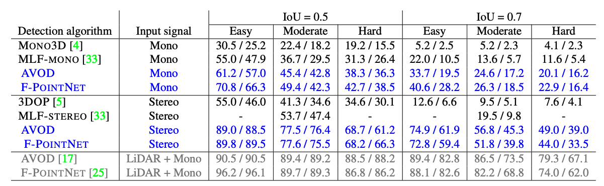

# Pseudo-LiDAR from Visual Depth Estimation: Bridging the Gap in 3D Object Detection for Autonomous Driving
This paper has been accpeted by Conference on Computer Vision and Pattern Recognition ([CVPR](http://cvpr2019.thecvf.com/)) 2019.

[
Pseudo-LiDAR from Visual Depth Estimation: Bridging the Gap in 3D Object Detection for Autonomous Driving](https://arxiv.org/abs/1812.07179)

by [Yan Wang](https://www.cs.cornell.edu/~yanwang/), [Wei-Lun Chao](http://www-scf.usc.edu/~weilunc/), [Divyansh Garg](http://divyanshgarg.com/), [Bharath Hariharan](http://home.bharathh.info/), [Mark Campbell](https://campbell.mae.cornell.edu/) and [Kilian Q. Weinberger](http://kilian.cs.cornell.edu/)


### Citation
```
@inproceedings{wang2019pseudo,
  title={Pseudo-LiDAR from Visual Depth Estimation: Bridging the Gap in 3D Object Detection for Autonomous Driving},
  author={Wang, Yan and Chao, Wei-Lun and Garg, Divyansh and Hariharan, Bharath and Campbell, Mark and Weinberger, Kilian},
  booktitle={CVPR},
  year={2019}
}
```
## Update
* 2nd July 2020: Add a jupyter script to visualize point cloud. It is in ./visualization folder.
* 29th July 2019: `submission.py` will save the disparity to the numpy file, not png file. And fix the `generate_lidar.py`.
* I have modifed the official avod a little bit. Now you can directly train and test pseudo-lidar with avod. Please check the code https://github.com/mileyan/avod_pl.

## Contents

- [Introduction](#introduction)
- [Usage](#usage)
- [Results](#results)
- [Contacts](#contacts)

## Introduction
3D object detection is an essential task in autonomous driving. Recent techniques excel with highly accurate detection rates, provided the 3D input data is obtained from precise but expensive LiDAR technology. Approaches based on cheaper monocular or stereo imagery data have, until now, resulted in drastically lower accuracies --- a gap that is commonly attributed to poor image-based depth estimation. However, in this paper we argue that data representation (rather than its quality) accounts for the majority of the difference. Taking the inner workings of convolutional neural networks into consideration, we propose to convert image-based depth maps to pseudo-LiDAR representations --- essentially mimicking LiDAR signal. With this representation we can apply different existing LiDAR-based detection algorithms. On the popular KITTI benchmark, our approach achieves impressive improvements over the existing state-of-the-art in image-based performance --- raising the detection accuracy of objects within 30m range from the previous state-of-the-art of 22% to an unprecedented 74%. At the time of submission our algorithm holds the highest entry on the KITTI 3D object detection leaderboard for stereo image based approaches.

## Usage

### 1. Overview

We provide the guidance and codes to train stereo depth estimator and 3D object detector using the [KITTI object detection benchmark](http://www.cvlibs.net/datasets/kitti/eval_object.php?obj_benchmark=3d). We also provide our pre-trained models.

### 2. Stereo depth estimation models
We provide our pretrained [PSMNet](http://openaccess.thecvf.com/content_cvpr_2018/papers/Chang_Pyramid_Stereo_Matching_CVPR_2018_paper.pdf) model using the Scene Flow dataset and the 3,712 training images of the KITTI detection benchmark.
- [Pretrained PSMNet](https://drive.google.com/file/d/1sWjsIO9Fuy92wT3gLkHF3PA7SP8QZBzu/view?usp=sharing)

We also directly provide the pseudo-LiDAR point clouds and the ground planes of training and testing images estimated by this pre-trained model. 
- [training/pseudo-lidar_velodyne](https://drive.google.com/file/d/10txZOtKk_aY3B7AhHjJPMCiRf5pP62nV/view?usp=sharing)
- [testing/pseudo-lidar_velodyne](https://drive.google.com/file/d/1XRAWYpMJeaVVXNN442xDgXnAa3pLBUvv/view?usp=sharing)
- [training/pseudo-lidar_planes](https://drive.google.com/file/d/1NBN85o9Jl7FjV5HwldmBv_9T4LeoNiwV/view?usp=sharing)
- [testing/pseudo-lidar_planes](https://drive.google.com/file/d/1G5_5VHbygssrKOzz1zEirNlKjVnMc5tz/view?usp=sharing)

We also provide codes to train your own stereo depth estimator and prepare the point clouds and gound planes. **If you want to use our pseudo-LiDAR data for 3D object detection, you may skip the following contents and directly move on to object detection models.**

#### 2.1 Dependencies
- Python 3.5+
- numpy, scikit-learn, scipy
- KITTI 3D object detection dataset

#### 2.2 Download the dataset
You need to download the KITTI dataset from [here](http://www.cvlibs.net/datasets/kitti/eval_object.php?obj_benchmark=3d), including left and right color images, Velodyne point clouds, camera calibration matrices, and training labels. You also need to download the image set files from [here](https://github.com/charlesq34/frustum-pointnets/tree/master/kitti/image_sets). Then you need to organize the data in the following way.
```angular2html
KITTI/object/
    
    train.txt
    val.txt
    test.txt 
    
    training/
        calib/
        image_2/ #left image
        image_3/ #right image
        label_2/
        velodyne/ 

    testing/
        calib/
        image_2/
        image_3/
        velodyne/
```
The Velodyne point clouds (by LiDAR) are used **ONLY** as the ground truths to train a stereo depth estimator (e.g., PSMNet).
#### 2.3 Generate ground-truth image disparities
Use the script`./preprocessing/generate_disp.py` to process all velodyne files appeared in `train.txt`. This is our **training ground truth**. Or you can directly download them from [disparity](https://drive.google.com/file/d/1JqtPdYnajNhDNxucuQYmD-79rl7MIXoZ/view?usp=sharing). Name this folder as `disparity` and put it inside the `training` folder.
```angular2html
python generate_disp.py --data_path ./KITTI/object/training/ --split_file ./KITTI/object/train.txt 
```

#### 2.4. Train the stereo model
You can train any stereo disparity model as you want. Here we give an example to train the PSMNet. The modified code is saved in the subfolder `psmnet`. Make sure you follow the `README` inside this folder to install the correct python and library. I strongly suggest using `conda env` to organize the python environments since we will use Python with different versions. Download the psmnet model pretrained on Sceneflow dataset from [here](https://drive.google.com/file/d/1D-OcFbrQXNl3iSOeBnMBGd87pNXp0RT1/view?usp=sharing).

```python2html
# train psmnet with 4 TITAN X GPUs.
python ./psmnet/finetune_3d.py --maxdisp 192 \
     --model stackhourglass \
     --datapath ./KITTI/object/training/ \
     --split_file ./KITTI/object/train.txt \
     --epochs 300 \
     --lr_scale 50 \
     --loadmodel ./pretrained_sceneflow.tar \
     --savemodel ./psmnet/kitti_3d/  --btrain 12
```

#### 2.5 Predict the point clouds
##### Predict the disparities.
```angular2html
# training
python ./psmnet/submission.py \
    --loadmodel ./psmnet/kitti_3d/finetune_300.tar \
    --datapath ./KITTI/object/training/ \
    --save_path ./KITTI/object/training/predict_disparity
# testing
python ./psmnet/submission.py \
    --loadmodel ./psmnet/kitti_3d/finetune_300.tar \
    --datapath ./KITTI/object/testing/ \
    --save_path ./KITTI/object/testing/predict_disparity
```
##### Convert the disparities to point clouds.
```angular2html
# training
python ./preprocessing/generate_lidar.py  \
    --calib_dir ./KITTI/object/training/calib/ \
    --save_dir ./KITTI/object/training/pseudo-lidar_velodyne/ \
    --disparity_dir ./KITTI/object/training/predict_disparity \
    --max_high 1
# testing
python ./preprocessing/generate_lidar.py  \
    --calib_dir ./KITTI/object/testing/calib/ \
    --save_dir ./KITTI/object/testing/pseudo-lidar_velodyne/ \
    --disparity_dir ./KITTI/object/testing/predict_disparity \
    --max_high 1
```
If you want to generate point cloud from depth map (like DORN), you can add `--is_depth` in the command.

#### 2.6 Generate ground plane
If you want to train an [AVOD]( https://github.com/kujason/avod) model for 3D object detection, you need to generate ground planes from pseudo-lidar point clouds.
```angular2html
#training
python ./preprocessing/kitti_process_RANSAC.py \
    --calib ./KITTI/object/training/calib/ \
    --lidar_dir  ./KITTI/object/training/pseudo-lidar_velodyne/ \
    --planes_dir /KITTI/object/training/pseudo-lidar_planes/
#testing
python ./preprocessing/kitti_process_RANSAC.py \
    --calib ./KITTI/object/testing/calib/ \
    --lidar_dir  ./KITTI/object/testing/pseudo-lidar_velodyne/ \
    --planes_dir /KITTI/object/testing/pseudo-lidar_planes/
```
### 3. Object Detection models
#### AVOD model
Download the code from [https://github.com/kujason/avod](https://github.com/kujason/avod) and install the Python dependencies. 

Follow their README to prepare the data and then replace (1) files in `velodyne` with those in `pseudo-lidar_velodyne` and (2) files in `planes` with those in `pseudo-lidar_planes`. Note that you should still keep the folder names as `velodyne` and `planes`.

Follow their README to train the `pyramid_cars_with_aug_example` model. You can also download our pretrained model and directly evaluate on it. But if you want to submit your result to the leaderboard, you need to train it on `trainval.txt`. 

- [pretrained AVOD](https://drive.google.com/file/d/1wuMykUDx8tcCfxpqnprmzrgUyheQV42F/view?usp=sharing) (trained only on train.txt)


#### Frustum-PointNets model
Download the code from [https://github.com/charlesq34/frustum-pointnets](https://github.com/charlesq34/frustum-pointnets) and install the Python dependencies. 

Follow their README to prepare the data and then replace files in `velodyne` with those in `pseudo-lidar_velodyne`. Note that you should still keep the folder name as `velodyne`.

Follow their README to train the v1 model. You can also download our pretrained model and directly evaluate on it.

- [pretrained Frustum_V1](https://drive.google.com/file/d/1qhCxw6uHqQ4SAkxIuBi-QCKqLmTGiNhP/view?usp=sharing) (trained only on train.txt)

## Results
The main results on the validation dataset of our pseudo-LiDAR method.


You can download the avod validation results from [HERE](https://drive.google.com/file/d/13nOhBCmj8rzjMHDEw3syROuqHsoxWIKJ/view?usp=sharing).


## Contact
If you have any question, please feel free to email us.

Yan Wang (yw763@cornell.edu), Harry Chao(weilunchao760414@gmail.com), Div Garg(dg595@cornell.edu)
